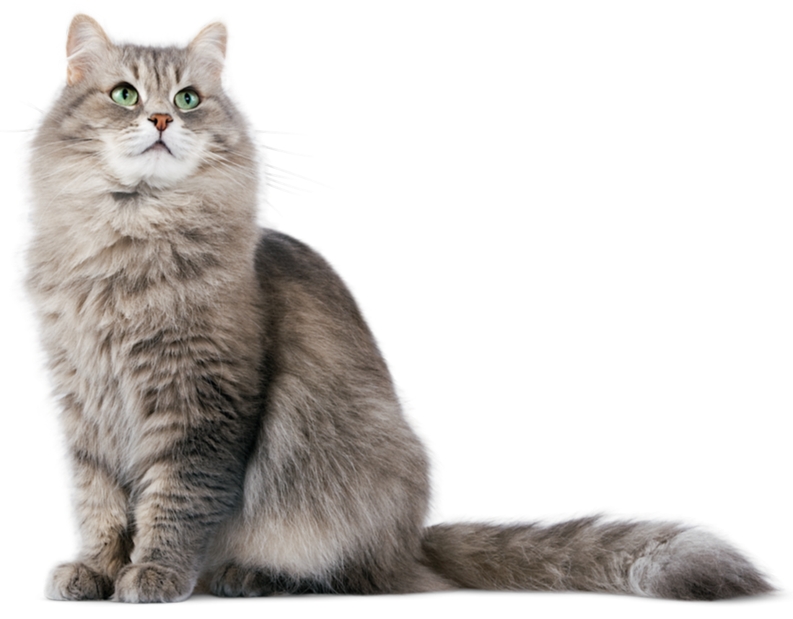

# Image Processing using Pillow

## Blur effect

|                        |                Original                 |             Blurred             |
| :--------------------: | :-------------------------------------: | :-----------------------------: |
|          RGB           |    |    |
| RGB with Alpha channel |  |  |

## Luminance adjustment

|                                                         |           Original (average_luminance=0.666)            |                                                           |
| :-----------------------------------------------------: | :-----------------------------------------------------: | :-------------------------------------------------------: |
|                                                         |                    |                                                           |
|    **target_luminance = 0.4; fixed scaling method**     |   **target_luminance = 0.4; average of two methods**    |      **target_luminance = 0.4; fixed delta method**       |
|  |  |  |

