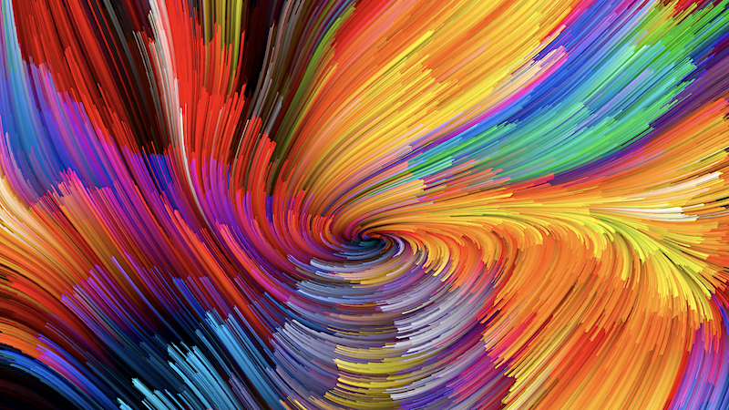
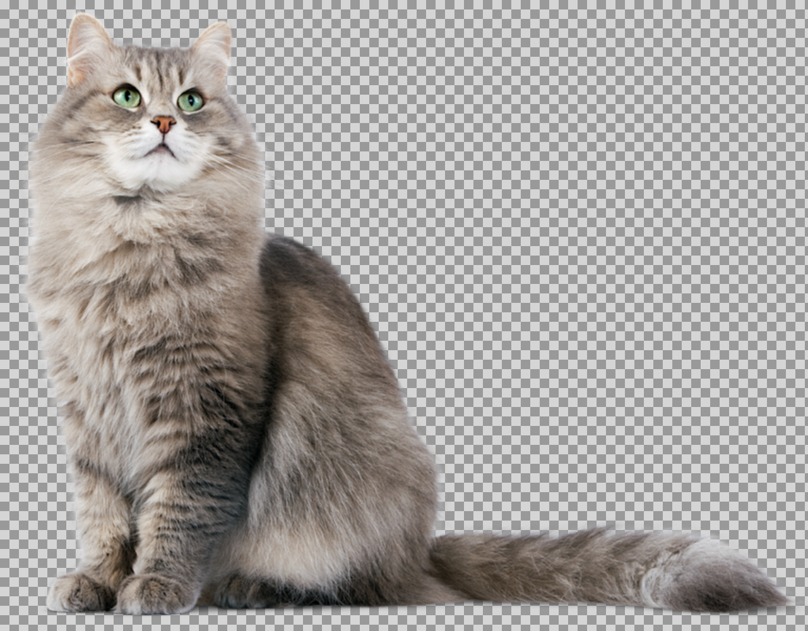
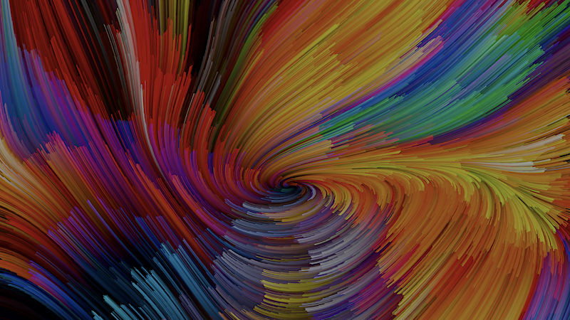
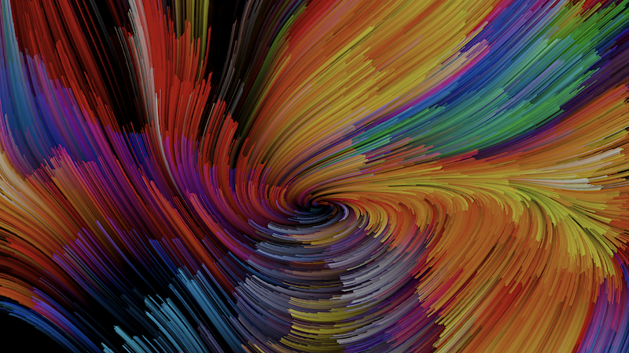
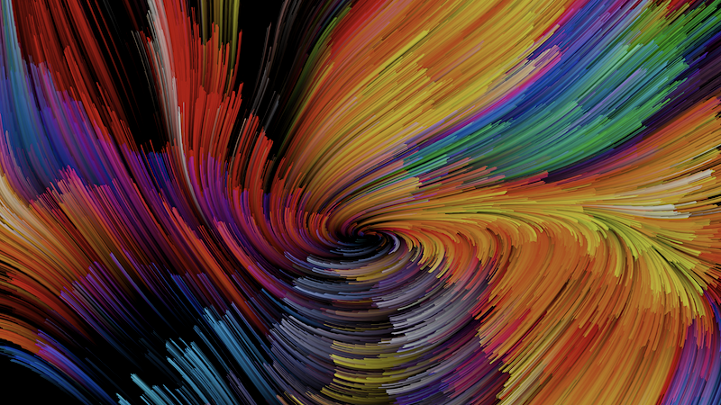

# Image Processing using Pillow

## Blur effect

|                        |                       Original                       |                   Blurred                    |
| :--------------------: | :--------------------------------------------------: | :------------------------------------------: |
|          RGB           |                 |                 |
| RGB with Alpha channel |  |  |

## Luminance adjustment

|                                                         |           Original (average_luminance=0.666)            |                                                           |
| :-----------------------------------------------------: | :-----------------------------------------------------: | :-------------------------------------------------------: |
|                                                         |                    |                                                           |
|    **target_luminance = 0.4; fixed scaling method**     |   **target_luminance = 0.4; average of two methods**    |      **target_luminance = 0.4; fixed delta method**       |
|  |  |        |

 <a href="https://github.com/chentl/SoftwareCarpentryWC3/tree/master/img_processing" class="btn" style=" color: #159957; border-color: #159957;">View on GitHub</a>

